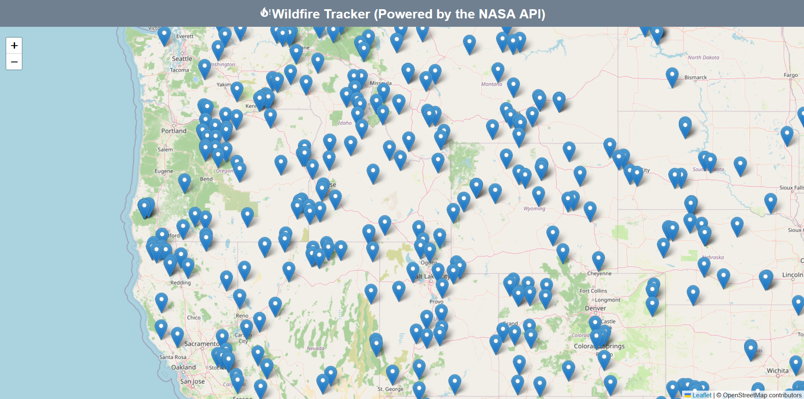
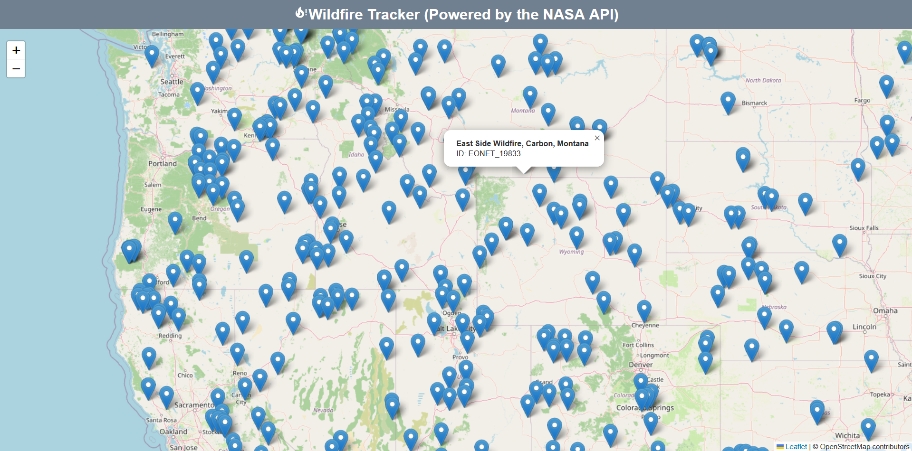

# Wildfire Tracker 🔥🌍

A real-time global wildfire tracking application built with **React** and **OpenStreetMap**, powered by the **NASA EONET API**. This project visualizes active wildfires across the globe using live satellite data.

## 📸 Showcase

| Main Overview | Wildfire Information  |
|---|---|
|  |  |

## Features

- **Live Data:** Fetches real-time natural event data from NASA's Earth Observatory Natural Event Tracker (EONET) v3 API.
- **Open Source Mapping:** Utilizes **OpenStreetMap** tiles via Leaflet.js, removing the need for Google Maps API keys or billing.
- **Interactive Markers:** Features clean, professional blue map pins for a data-centric aesthetic.
- **Detailed Information:** Clickable map markers provide specific event IDs and titles via native popups.
- **Custom UI:** A responsive dashboard featuring a persistent `slategray` header and custom CSS layouts.
- **Global Scope:** Tracks active fires across all continents, filtered for accuracy within a 365-day window.

## Tech Stack

- **Frontend:** React.js
- **Mapping:** React-Leaflet / OpenStreetMap
- **API:** NASA EONET v3
- **Styling:** CSS3

## How it Works

The application performs an asynchronous fetch to the NASA API upon mounting. It filters the incoming JSON data to isolate wildfire categories and validates the geometry data. These coordinates are then mapped into individual Marker components within the Leaflet MapContainer using OpenStreetMap tiles.

## Acknowledgments

- NASA for the open-source EONET API.
- OpenStreetMap for the community-driven map tiles.
- Traversy Media for the initial project concept.